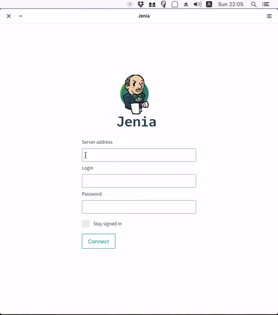

[![travis][travis-image]][travis-url]

[travis-image]: https://img.shields.io/travis/roman0x58/jenia.svg?style=flat-square
[travis-url]: https://travis-ci.org/roman0x58/jenia

## - about
**Jenia** is an open-source cross-platform application that provide a usable GUI interface for Jenkins CI. It should make you happy to build your code every day. This application have been created as a hobby project and the first purpose of it is to build your Jenkins CI jobs quickly and less painfully, becuase IMHO the Jenkins UI is a bit ugly and unsable. Jenia built on [Electron](https://electron.atom.io/) and uses [Mithril](https://mithril.js.org).

## - installation
Just download the specific package for your platform on the releases page or directly from the [website](https://jenia.pl). 
- Jenia was tested using Jenkins of version 1.6xx, 2.5x, 2.6x with or without Git plugin. 
- The time on Jenkins server should be correctly set, otherwise you will see an incorrect build progress status.
> N.B. If you have some troubles with a package for your OS or found some bugs please create an issue about this.

## - features
* The bookmarks with hotkeys for your jobs with access from the tray menu
* Compact & better UI than default Jenkins CI interface
* Shorthand actions for a job such as console output and build job.
* Parametrizied build support (The application only supports choiсe, string, text, boolean parameters, if you have a different parameter than you can create PR for this)

## - todo's
The application still in a developing process and have the tons of ideas and some things that need be refactored, but general I want to do the next in the future
* A job progress in the tray menu
* Additional information at the build view (such as parameters of a build)
* System notifications of build finishing
* Functional tests

## - contributing
Before you start check you node version it must be `7` or greater
1. Fork this repository and clone locally
2. Install the dependencies: `npm install`
3. Install gulp cli : `npm install -g gulp-cli`
4. To watch & run the application, type next: `gulp start`
5. Make some changes that you will desire and and if you want create [PR](https://help.github.com/categories/collaborating-with-issues-and-pull-requests/) 

## - installers
- To build installer use the following command on the apropriate host machine `gulp pkg --type=(rpm|deb|exe|dmg) --env=production`
- To build `rpm/deb` installers the simpliest way to do it is install [Docker](https://www.docker.com/) and run `docker-compose run deb && docker-compose run rpm`

## - thanks 
To all dev's who makes open-source better, especially those whose projects are used in the application.

## - etc
What is Jenia? **Jenia**(Женя) is a russian female name. By the way if you illustrator I would appreciate it if you draw a cartoon girl as application icon.

Published by [MIT](LICENSE) license.
